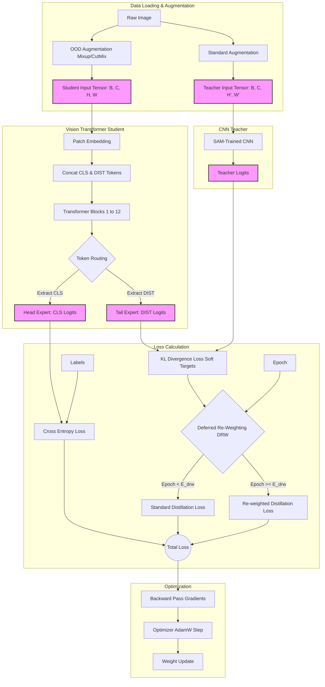

# Stage 2: Computational Graph

This flowchart visualizes the complete forward and backward pass of the DeiT-LT framework.

```mermaid
graph TD
    subgraph Data Loading & Augmentation
        A[Raw Image] --> B[OOD Augmentation Mixup/CutMix]
        B --> C[Student Input Tensor: B, C, H, W]
        A --> D[Standard Augmentation]
        D --> E[Teacher Input Tensor: B, C, H', W']
    end

    subgraph Vision Transformer Student
        C --> F[Patch Embedding]
        F --> G[Concat CLS & DIST Tokens]
        G --> H[Transformer Blocks 1 to 12]
        H --> I{Token Routing}
        I -->|Extract CLS| J[Head Expert: CLS Logits]
        I -->|Extract DIST| K[Tail Expert: DIST Logits]
    end

    subgraph CNN Teacher
        E --> L[SAM-Trained CNN]
        L --> M[Teacher Logits]
    end

    subgraph Loss Calculation
        J --> N[Cross Entropy Loss]
        Labels --> N
        
        K --> O[KL Divergence Loss Soft Targets]
        M --> O
        
        O --> P{Deferred Re-Weighting DRW}
        Epoch --> P
        P -->|Epoch < E_drw| Q[Standard Distillation Loss]
        P -->|Epoch >= E_drw| R[Re-weighted Distillation Loss]
        
        N --> S((Total Loss))
        Q --> S
        R --> S
    end

    subgraph Optimization
        S --> T[Backward Pass Gradients]
        T --> U[Optimizer AdamW Step]
        U --> V[Weight Update]
    end

    %% Styling
    classDef tensor fill:#f9f,stroke:#333,stroke-width:2px;
    class C,E,J,K,M tensor;
```
